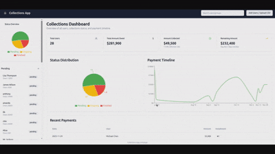

# Collections Strategy Management System

A full-stack application for managing debt collection strategies with AI-powered decision blocks and timeline-based planning. The system helps organizations create, manage, and execute collection strategies for users and groups.




## Features

- **User & Group Management**: Manage individual users and groups with detailed contact information
- **AI-Powered Strategy Generation**: Generate collection strategies using xAI Grok (with deterministic fallback)
- **Decision Blocks**: Add intelligent conditional logic between action blocks
- **Enhanced Contact Details**: Specify exact contact methods (email, phone, SMS) with preferred contact indicators
- **Timeline-Based Planning**: Visual kanban board with 6 timeline stages (Day 1-7 through Day 90+)
- **File Ingestion**: Upload Excel or PDF files to import user data
- **Analytics Dashboard**: View collection status analytics and metrics
- **Strategy Execution**: Track and execute collection strategies

## Tech Stack

### Backend
- **Python 3.x**: Core programming language
- **FastAPI**: Modern, fast web framework for building APIs
- **SQLAlchemy**: SQL toolkit and ORM for database operations
- **Pydantic**: Data validation using Python type annotations
- **Uvicorn**: ASGI server for running FastAPI
- **SQLite**: Lightweight database for data persistence
- **Pandas**: Data manipulation and analysis (for Excel file processing)
- **PyPDF2**: PDF file processing
- **httpx**: HTTP client for API calls (xAI integration)
- **pytest**: Testing framework

### Frontend
- **React 18**: UI library for building user interfaces
- **Vite**: Next-generation frontend build tool
- **Material-UI (MUI)**: React component library for UI design
- **Redux Toolkit**: State management library
- **React Redux**: React bindings for Redux
- **Axios**: HTTP client for API requests
- **React Beautiful DnD**: Drag and drop functionality
- **React Dropzone**: File upload component
- **Recharts**: Charting library for analytics
- **React Router DOM**: Client-side routing
- **date-fns**: Date utility library
- **Lodash**: JavaScript utility library

### Development Tools
- **Conda**: Environment management (using "serve" environment)
- **Git**: Version control

### Optional Integrations
- **xAI Grok API**: AI-powered strategy generation (optional, falls back to deterministic strategies)

## Project Structure

```
serve_collection/
├── app/                          # Backend application
│   ├── __init__.py
│   ├── database.py              # SQLAlchemy database setup
│   ├── models.py                # Database models (User, Group, Strategy)
│   ├── schemas.py               # Pydantic schemas for validation
│   ├── crud.py                  # Database operations
│   ├── routers_ingestion.py     # File upload endpoints
│   ├── routers_users.py         # User/group management endpoints
│   └── routers_strategies.py    # Strategy management endpoints
├── frontend/                     # React frontend application
│   ├── src/
│   │   ├── api/                 # API client and services
│   │   ├── components/          # React components
│   │   ├── features/            # Redux slices
│   │   ├── store/               # Redux store configuration
│   │   ├── App.jsx              # Main app component
│   │   └── main.jsx             # Entry point
│   ├── package.json
│   └── vite.config.js
├── main.py                       # FastAPI application entry point
├── populate_mock_data.py         # Script to populate database with mock data
├── requirements.txt              # Python dependencies
├── test_app.py                   # Backend tests
└── README.md                     # This file
```

## Architecture

### Backend Architecture (FastAPI)
- **RESTful API**: FastAPI-based backend with automatic OpenAPI documentation
- **Database Models**: SQLAlchemy ORM models for User, Group, and Strategy entities
- **Router Pattern**: Modular routing with separate routers for ingestion, users, and strategies
- **Dependency Injection**: FastAPI's dependency system for database sessions
- **CORS Middleware**: Configured for frontend communication

### Frontend Architecture (React + Redux)
- **Component-Based**: Modular React components with Material-UI
- **State Management**: Redux Toolkit for global state (users, strategies)
- **API Layer**: Axios-based API client with Redux async thunks
- **Responsive Design**: Material-UI components with responsive layouts

### Data Models
- **User**: Individual entity with name, details (JSON), status (pending/ongoing/finished), and contact methods
- **Group**: Collection of users with shared status
- **Strategy**: Timeline-based collection plan with action and decision blocks

### Status Flow
Users and Groups progress through: `pending` → `ongoing` → `finished`

## Installation & Setup Guide

This guide will help you get the Collections Strategy Management System running on your local machine.

### Prerequisites
- **Python 3.8+**: Download from [python.org](https://python.org)
- **Node.js 16+ and npm**: Download from [nodejs.org](https://nodejs.org)
- **Conda** (recommended for environment management): Download from [conda.io](https://conda.io)
- **Git**: For cloning the repository

### Step 1: Clone the Repository

```bash
git clone <your-github-repo-url>
cd serve_collection
```

### Step 2: Backend Setup

1. **Create and activate Conda environment:**
```bash
# Create the environment (only needed once)
conda create -n serve python=3.9

# Activate the environment (needed for every session)
conda activate serve
```

2. **Install Python dependencies:**
```bash
pip install -r requirements.txt
```

3. **Set up environment variables for AI integration (Optional but Recommended):**
```bash
# Create a .env file in the project root
touch .env

# Edit the .env file and add your OpenAI API key
# OPENAI_API_KEY=your-openai-api-key-here
# OPENAI_MODEL=gpt-4o-mini  # Optional, defaults to gpt-4o-mini
# OPENAI_API_BASE_URL=https://api.openai.com/v1  # Optional, defaults to OpenAI

# Or export them directly in your shell
export OPENAI_API_KEY="your-openai-api-key-here"
```

**Note:** If you don't set the `OPENAI_API_KEY`, the application will use deterministic fallback strategies instead of AI-generated ones.

### Step 3: Frontend Setup

1. **Navigate to frontend directory:**
```bash
cd frontend
```

2. **Install Node.js dependencies:**
```bash
npm install
```

3. **Return to project root:**
```bash
cd ..
```

### Step 4: Database Setup

The application uses SQLite, which will be created automatically. To populate with sample data:

```bash
# Remove existing database (optional, for fresh start)
rm test.db

# Populate with mock data
conda activate serve
python populate_mock_data.py
```

## Step 5: Running the Application

### Development Mode

You'll need two terminal windows/tabs to run both the backend and frontend simultaneously.

**Terminal 1 - Start the Backend:**
```bash
# Ensure you're in the project root and conda environment is activated
conda activate serve
uvicorn main:app --reload --host 0.0.0.0 --port 8000
```
- Backend API will be available at: `http://localhost:8000`
- API Documentation: `http://localhost:8000/docs` (Swagger UI)
- Alternative Docs: `http://localhost:8000/redoc`

**Terminal 2 - Start the Frontend:**
```bash
cd frontend
npm run dev
```
- Frontend application will be available at: `http://localhost:3000`
- The frontend will automatically proxy API requests to the backend

### Verify Installation

1. **Check Backend:** Visit `http://localhost:8000` - you should see `{"message": "Collections strategy backend is running"}`
2. **Check API Docs:** Visit `http://localhost:8000/docs` - you should see the Swagger documentation
3. **Check Frontend:** Visit `http://localhost:3000` - you should see the Collections Strategy Management interface

### Production Mode (Optional)

**Build Frontend for Production:**
```bash
cd frontend
npm run build
npm run preview  # Preview the production build
```

**Run Backend in Production:**
```bash
conda activate serve
uvicorn main:app --host 0.0.0.0 --port 8000
```

## Testing

### Backend Tests
```bash
# Run all tests
pytest

# Run specific test
pytest test_app.py::test_root -v

# Run with output
pytest -s
```

### Frontend
The frontend uses Vite's built-in development server with hot module replacement.

## API Documentation

Once the backend is running, visit:
- **Swagger UI**: `http://localhost:8000/docs`
- **ReDoc**: `http://localhost:8000/redoc`

## Key Features Explained

### AI Decision Blocks
Add conditional logic between action blocks to create dynamic strategies. Decision blocks evaluate conditions based on user data (payment history, communication logs, etc.) and branch to different outcomes.

### Enhanced Contact Details
Specify exact contact methods (email addresses, phone numbers) for each action block, with support for preferred contact indicators.

### Timeline Stages
The strategy timeline includes 6 stages with color-coded urgency:
- **Day 1-7**: Green (Friendly tone)
- **Day 8-14**: Light Green (Neutral tone)
- **Day 15-30**: Yellow (Firm tone)
- **Day 31-50**: Orange (Firm tone)
- **Day 51-90**: Deep Orange (Escalation tone)
- **Day 90+**: Red (Escalation tone)

## Configuration

### Environment Variables

The application uses the following environment variables:

#### Required for AI Features
- `OPENAI_API_KEY`: Your OpenAI API key for AI-generated strategies
  - Get one at: https://platform.openai.com/api-keys
  - If not set, the app uses deterministic fallback strategies

#### Optional AI Configuration
- `OPENAI_MODEL`: AI model to use (default: `gpt-4o-mini`)
  - Other options: `gpt-3.5-turbo`, `gpt-4`, etc.
- `OPENAI_API_BASE_URL`: Custom API base URL (default: `https://api.openai.com/v1`)
  - Useful for proxies or custom endpoints

#### Setting Environment Variables

**Option 1: Using a .env file (Recommended)**
```bash
# Create .env file in project root
echo "OPENAI_API_KEY=your-key-here" > .env
echo "OPENAI_MODEL=gpt-4o-mini" >> .env
```

**Option 2: Export in shell**
```bash
export OPENAI_API_KEY="your-key-here"
export OPENAI_MODEL="gpt-4o-mini"
```

### Database Configuration

The application uses SQLite (`test.db`) which is created automatically on first run.

**Database Location:** `test.db` in the project root directory

**Reset Database:**
```bash
# Stop the backend server first
rm test.db
# Restart the backend - tables will be recreated automatically
```

**Database Schema:**
- `users`: Individual users with contact information
- `groups`: Collections of users
- `strategies`: Collection strategies with timeline blocks

### CORS Configuration

The backend is configured to accept requests from:
- `http://localhost:3000` (development frontend)
- `http://127.0.0.1:3000` (alternative localhost)

For production deployment, update the CORS origins in `main.py`.

## Troubleshooting

### Common Issues & Solutions

#### 1. Backend Won't Start
**Symptoms:** `uvicorn main:app --reload` fails or shows errors

**Solutions:**
- Ensure Conda environment is activated: `conda activate serve`
- Check Python version: `python --version` (should be 3.8+)
- Verify dependencies: `pip install -r requirements.txt`
- Check if port 8000 is available: `lsof -i :8000`
- Try different host: `uvicorn main:app --reload --host 127.0.0.1 --port 8000`

#### 2. Frontend Won't Start
**Symptoms:** `npm run dev` fails or shows errors

**Solutions:**
- Check Node.js version: `node --version` (should be 16+)
- Verify dependencies: `cd frontend && npm install`
- Check if port 3000 is available: `lsof -i :3000`
- Clear node_modules: `rm -rf node_modules && npm install`

#### 3. Cannot Connect to Backend from Frontend
**Symptoms:** Frontend loads but API calls fail

**Solutions:**
- Ensure backend is running on port 8000
- Check CORS: Backend should accept requests from `http://localhost:3000`
- Verify API endpoints: Visit `http://localhost:8000/docs`
- Check browser console for CORS errors

#### 4. Database Issues
**Symptoms:** Data not persisting or errors about database

**Solutions:**
- Check if `test.db` exists in project root
- Reset database: `rm test.db` then restart backend
- Populate sample data: `python populate_mock_data.py`
- Check file permissions on `test.db`

#### 5. AI Strategy Generation Not Working
**Symptoms:** Strategies are deterministic instead of AI-generated

**Solutions:**
- Set `OPENAI_API_KEY` environment variable
- Check API key validity at https://platform.openai.com/api-keys
- Verify internet connection for API calls
- Check backend logs for API errors

#### 6. Import/Upload Features Not Working
**Symptoms:** Cannot upload Excel/PDF files

**Solutions:**
- Check file permissions on `uploads/` directory
- Verify required Python packages: `pip install pandas PyPDF2`
- Check file formats (Excel: .xlsx/.xls, PDF: .pdf)
- Review backend logs for detailed error messages

#### 7. Port Already in Use
**Symptoms:** "Port 8000/3000 already in use"

**Solutions:**
- Find process using port: `lsof -i :8000` or `lsof -i :3000`
- Kill process: `kill -9 <PID>`
- Or use different ports: `--port 8001` for backend, change Vite config for frontend

#### 8. Conda Environment Issues
**Symptoms:** `conda activate serve` fails

**Solutions:**
- Create environment if missing: `conda create -n serve python=3.9`
- Initialize conda for your shell: `conda init <shell>`
- Restart terminal after conda init
- Use full path: `~/anaconda3/bin/conda activate serve`

### Getting Help

1. **Check Logs:** Both backend and frontend will show detailed error messages
2. **API Documentation:** Visit `http://localhost:8000/docs` for endpoint details
3. **Browser Console:** Check for JavaScript errors (F12 → Console)
4. **Test Endpoints:** Use Swagger UI to test API endpoints directly

### System Requirements Check

Run these commands to verify your system:

```bash
# Python & Conda
python --version          # Should be 3.8+
conda --version          # Should work
conda activate serve     # Should activate environment

# Node.js & npm
node --version           # Should be 16+
npm --version            # Should work

# Git
git --version            # Should work

# Ports (should be empty)
lsof -i :8000 || echo "Port 8000 free"
lsof -i :3000 || echo "Port 3000 free"
```

## Development Notes

### Database Session Management
All endpoints use FastAPI's dependency injection for database sessions. Sessions are automatically committed/closed by CRUD functions.

### Owner Polymorphism
Strategies can belong to either a `user` or a `group`. Use `owner_type` parameter ("user" or "group") in strategy endpoints.

### File Ingestion
The `/ingestion/upload` endpoint handles:
- **Excel files** (.xlsx, .xls): Extracts user data from first row (requires "name" column)
- **PDF files** (.pdf): Extracts text into `details["history_text"]`, requires `user_id` param or creates new user

## Contributing

1. Ensure you're using the `serve` Conda environment for Python development
2. Follow existing code patterns and structure
3. Write tests for new features
4. Update documentation as needed

## License

[Add your license information here]

## Support

For issues and questions, please refer to the QUICK_START.md guide or check the API documentation at `/docs` when the server is running.

